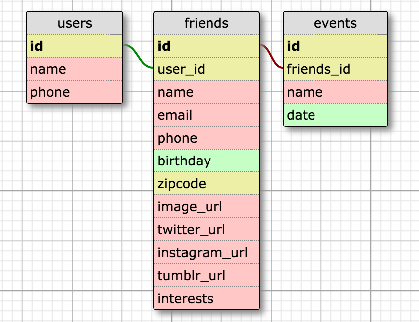

# FriendDB
Mobile-friendly platform for tracking friends’ social media, interests, and life events. 

# Usage
1. Fork and clone the repo
2. 'npm install' from the root directory
3. 'npm start' from the root directory
4. 'ionic serve' from clientRefactor

See IonicGuide.md for instructions on installing and using Ionic. 

##Database Schema




##Existing API Endpoints

|      URL                                            | HTTP Verb | Result                          |
|:---------------------------------------------------:|:---------:|:-------------------------------------------------------:|
| /                                                   |    GET    | Serve application static files |
| /login                                              |    GET    | userLoginObj |
| /login-verify                                       |    GET    | userLoginObj  |
| /api/logininfo                                      |    GET    | userObj |
| /api/users                                          |    POST   | userObj |
| /api/users/:userId                                  |    GET    | userObj |
| /api/users/:userId                                  |    GET    | friendsObj |
| /api/users/:userId/friends                          |    POST   | friendsObj |
| /api/users/:userId/friends                          |    GET    | friendObj |
| /api/friends/:friendId                              |    GET    | friendObj |
| /api/friends/:friendId                              |    PUT    | friendObj |
| /api/friends/:friendId                              |    DELETE | null |
| /api/friends/:friendId/posts                        |    GET    | postsObj |
| /api/friends/:friendId/gifts                        |    GET    | giftsObj |
| /api/friends/:friendId/weather                      |    GET    | weatherObj |
| /api/friends/:friendId/local                        |    GET    | localObj |
| /api/friend/:friendId/events                        |    POST   | eventsObj |
| /api/friend/:friendId/events                        |    GET    | eventsObj |
| /api/events/:eventID                                |    GET    | eventObj |
| /api/events/:eventID                                |    PUT    | eventObj |
| /api/events/:eventID                                |    DELETE | null |

##Data Formats
####Friend object format.  The object that is on req.body for both `POST` and `PUT`.

```json
{
  "user_id": "integer",
  "name": "string",
  "email": "string",
  "phone": "string",
  "birthday": "date",
  "zipcode": "string",
  "image_url": "string",
  "interests": "string",
  "twitter_username": "string",
  "instagram_username": "string",
  "tumblr_username": "string",
}

```
####Event object format.  The object that is on req.body for both `POST` and `PUT`.

```json
{
  "friend_id": "integer",
  "name": "string",
  "date": "date",
}
```

##Outgoing API Endpoints

|API NAME | Base_URL | HTTP Verb | Request Body |   Used Fields                          |
|:-------:|:-----------------:|:---------:|:------------:|:-------------------------------------------------------:|
| Twilio  | npm modules: twilio |    GET    |    None     | Sends a text message, response is JSON object
| Bing News  | npm modules: node-bing-api             |    GET    |    JSON     |  Array of articles: Description, Title, Article Url
| Open Weather  | http://api.openweathermap.org/data/2.5/weather  |    GET    |    JSON     | Temp, Location, Description, IconId
| Tumblr  | npm modules: tumblr |    GET    |     JSON     |  Object containing Tumblr posts and content based on user id
| Twitter  | npm modules: twitter |    GET    |     JSON     |  Object containing Twitter posts and content based on user id
| Amazon | npm modules: amazon-product-api  |    GET    |     JSON     |  Object containing Amazon products based on serach term
